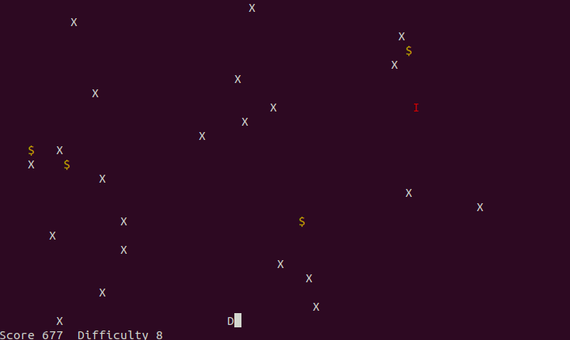
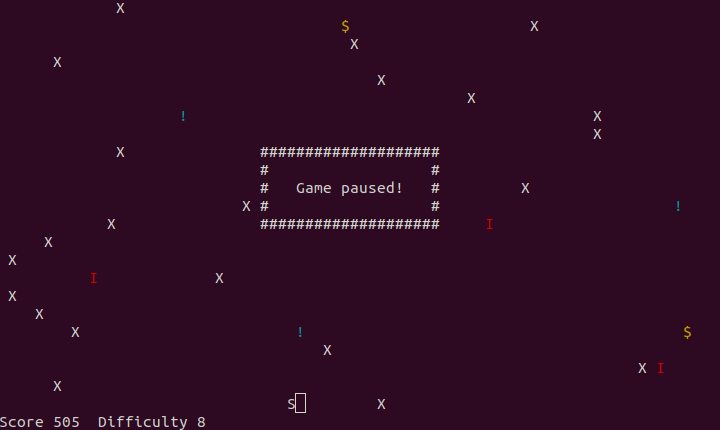
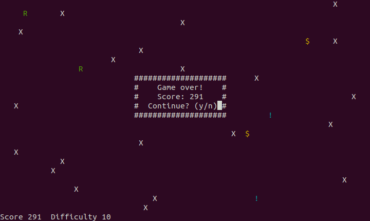

# Dodger Game
A simple command line runner game, written in forth. The goal of the game is to dodge enemies, collect score and upgrades.





# Usage

Developed and tested with [**Gforth**](https://www.gnu.org/software/gforth) version **0.7.3**.

## Start
```bash
gforth dodger.fs
```
## Play
* Arrow Left - Move left
* Arrow Right - Move Right
* Space - Pause

# Authors
* Andreas Scheidl
* Christoph Presch
